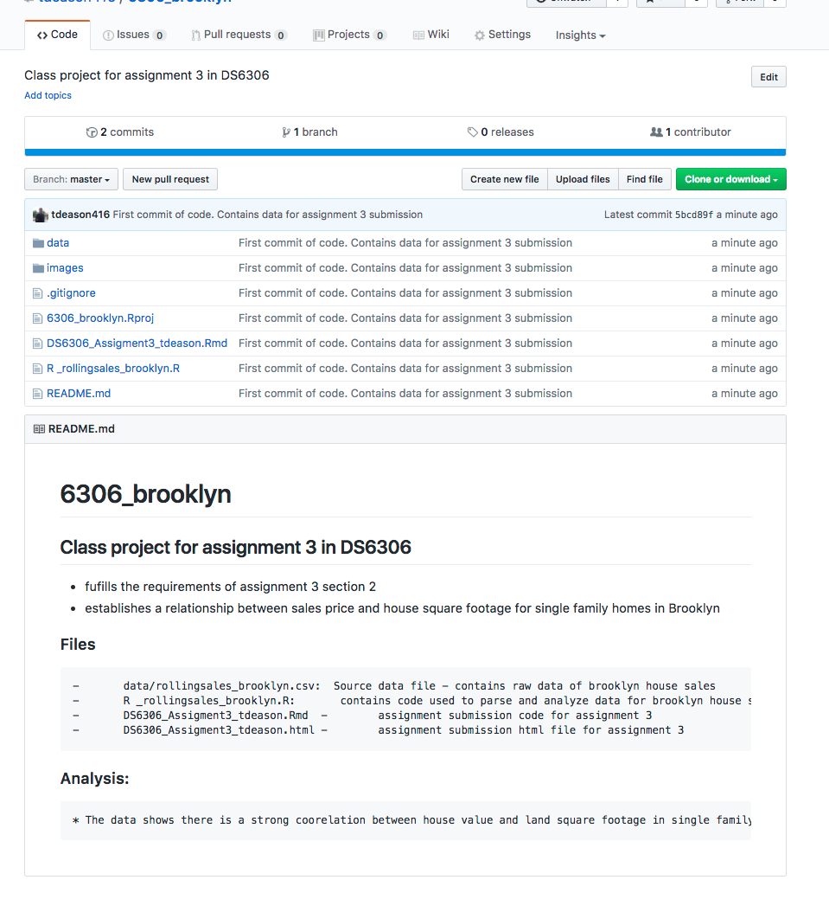

--
title: "Doing Data Science - Assignment2 "
author: "Travis Deason"
date: "Sept, 14th 2017"
output:  html_document
---

# Live session unit 02 assignment

Calculation Questions (using R) - Use R to calculate the following:
NOTE: Submit a word file with the R codes in text format and its screenshot that shows the result.

```{r, echo=FALSE, message=FALSE}
rm( list = ls()); cat("\014")  # Clear environment
```

***
#### Question 1. (30%) swirl R Programming; Take a screenshot that shows the last code result or completion message.


***
#### Question 2 -	1.	(35%) Using the Rolling Data Sales website, download and examine housing sales data set of Brooklyn - which is named and downloadable here - “[XLS] Brooklyn” - at the web site - Rolling Housing Sales for NYC. You could download “” from box.com as well if you have a technical difficulty but I recommend you to download it from the web site. I need a screenshot of the project.

**a**\.	a.	Goal: Create an RStudio project for the analysis of this data set. Your file structure within the project should include the following:

*	A README file in the project root directory that includes an explanation of the purpose of the project and the other files

  - File Contained within readme.md 
  
* A source directory containing R_rollingsales_brooklyn.R that you have to complete; There are 4 TODO comments that you have to look at and complete. Your code R_rollingsales_brooklyn.R clean up the input csv data. The clean up includes finding out where there are outliers or missing values, deciding how you will treat them, making sure values you think are numerical are being treated as such (correct R class), etc.

* A data directory containing input csv file to load in. 

* A paper directory containing a file (plain text or Markdown) that explains any meaningful patterns in this dataset. You can present at most 2 paragraphs. 


***
#### 3.	 (25%) Make your Github to have the above R project with its file structure, which you have practiced at the lecture with Deluge Design Organization. You need to present your github URL - not an image – in the text format and take a screenshot of your repository page on GitHub showing the github URL and folder structure.

[Brooklyn Housing Project Git Page](https://github.com/tdeason416/6306_brooklyn)


